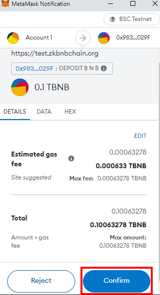
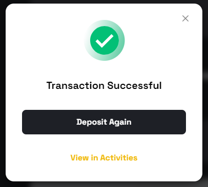

# Fund zkBNB Wallet with Test BNB

[zkBNB Wallet](https://test.zkBNBchain.org/wallet) provides seamless integration with BNB Smart Chain (Layer 1) and zkBNB (Layer 2). Furthermore, you can use the same wallet address for both zkBNB and the BSC chain, hence, making it more convenient for users to manage their assets.

As of now, there is no faucet available, however, you can get test BNB tokens from the [BSC Test Faucet](https://testnet.bnbchain.org/faucet-smart) into your BSC account and then bridge them into zkBNB using the zkBNB Wallet web application.

In this tutorial, we provide a step-by-step guide on how to use the zkBNB wallet to bridge your assets into zkBNB.

## Pre-requisites
- [Metamask Web Extension](https://metamask.io/)

## Steps to Fund your zkBNB 

:::note
This tutorial is based on transferring BNB Tokens from BSC Testnet to zkBNB Testnet. However, the steps are same for the mainnet as well.
:::

### Step#1: Creating a BNB Wallet and funding it with BNB Test Tokens
For this tutorial, we will be using Metamask Web Wallet. As a first step, follow [this user guide](https://academy.binance.com/en/articles/connecting-metamask-to-binance-smart-chain) to configure your Metamask Wallet with BSC Testnet and fund it with Test BNB tokens.

### Step#2: Transfering Test BNB tokens onto zkBNB using the Bridge
In order to officially use the zkBNB chain, we need to have some BNB test tokens in our zkBNB Wallet. After acquirign some test tokens in your BSC account, it is then time to transfer these into zkBNB Wallet. For this, we'll be bridging our test BNB tokens over to zkBNB using a Bridge that connects the zkBNB chain with the BNB Smart Chain.

1. On the zkBNB Wallet homepage, click on _Connect Wallet_ button.

2. Select Metamask from the popup.

3. Click _Bridge Assets to L2_ to deposit BNB tokens on the zkBNB. 

4. Select the type of token you’d like to transfer. You may transfer any BEP20/721/1155 token. For this tutorial, we will select the BNB token. Also, specify the amount of tokens to transfer. Remember, **_0.00015 BNB_** is the minimum amount allowed to bridge onto zkBNB from BSC.

5. Click on the _Deposit_ button after confirming the amount to transfer from BSC to zkBNB.

6. Once you click the Deposit button, Metamask notification will pop up asking for confimation to proceed the transaction. Click on _Confirm_.

7. Upon successful transfer, you will see a pop after transaction confirmation.

### Step#3: Verify the transfer

1. You may now check the status of your transaction by clicking on the _Activities_ tab on the left side of the zkBNB Wallet homepage.

2. On the activities, you will be able to see the transaction on zkBNB's block explorer [_ZKTRACE_](https://explorer-test.zkbnbchain.org/).

##### Congratulations 🎉
You have successfully completed transfer of BNB Tokens from BNB Smart Chain to zkBNB Transfer. You may now take full advantage of the zkBNB Marketplace, while spending less in fee's on any zkBNB dApp on BNB Smart Chain. All transactions will be up to >=95% cheaper, and >95% faster. 

